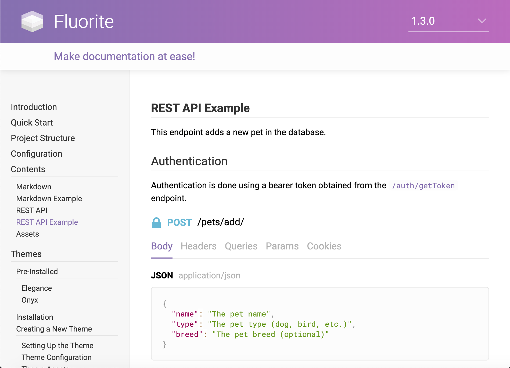

# Fluorite

Fluorite is an easy-to-use API documentation generator, built to allow rapid development of API documentations (RESTful and other types of APIs) while being flexible in design.

Fluorite encourages modular structures, therefore, the documentation is made of different files grouped together as sections through a JSON configuration file named `flconfig.json`. Files are either JSON files (for documenting RESTful APIs) or pure Markdown (for other documentations,) all loaded into one or more HTML pages to form the documentation.

Fluorite is also flexible in design through themes. Each theme decides on the documentation layout and can even define extra features using the provided utility libraries, independent of any pre-defined mechanism. You can easily make your own themes using the Handlebars templating language and have your documentations look exactly the same as your website/web app.

# Installation

  - Make sure you have Node.js and NPM installed
  - Install Fluorite globally: `npm install @chisel/fluorite -g`

# Quick Start

  - Create a new project: `fl new <name>` (example `fl new docs`)
  - Inside the project directory run: `fl build`
  - Serve: `fl serve`
  - Visit `http://localhost:6001`

# Full Documentation

Fluorite is heavily documented using Fluorite! We strongly recommend you to read the [official documentation](https://fluorite.js.org) after playing around with Fluorite to fully benefit from its features.
